# MSX MEGA-SCC RAM 8Mbit version  

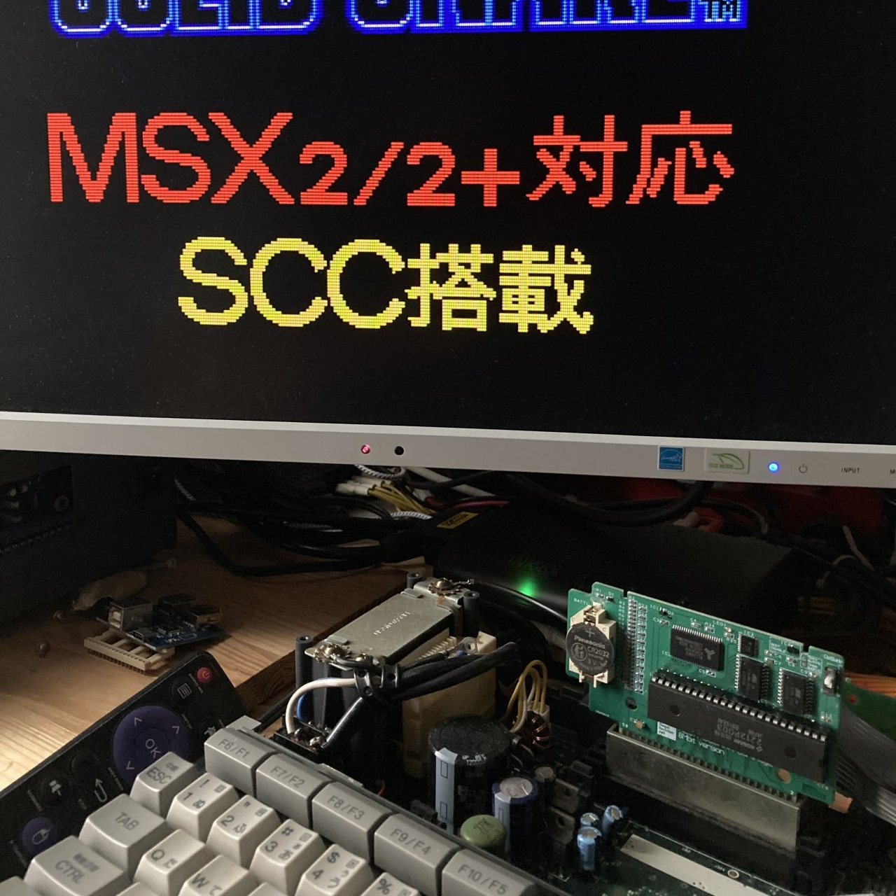  

SCCのFlash Cartridge MEGA-SCC(似非SCC)のSRAM Versionです。  
SCC (2212P003) の最大容量は4Mbitですが、独自拡張をすることで8Mbitに対応しています。  

スイッチ切り替えにて4Mbitx2のマルチSCCカートとしても使用することができます。　　

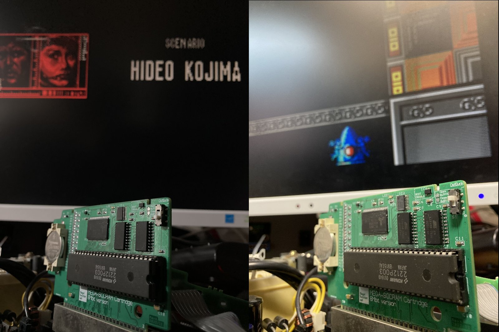

DACには、KONAMI051650と同等回路をあえて採用し、音質面で違いが出ないようにしています。   
ノイズ対策として大容量コンデンサーを搭載、SCC自体からでるノイズを低減させています。  

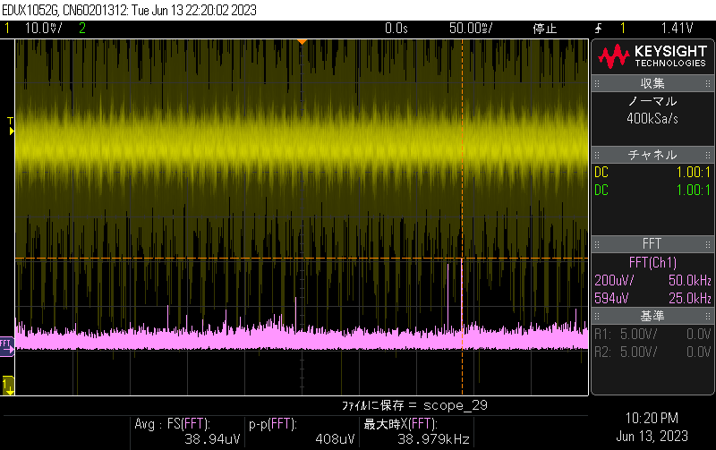 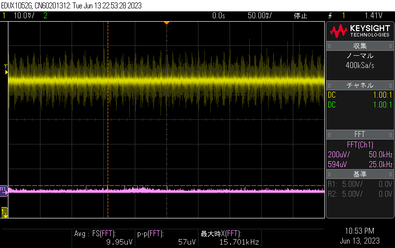  
(左：オリジナル相当　右：本製品)

SRAMのバックアップ用には、電圧監視ICを搭載しておりデータ消失が起きにくい回路構成になっています。  

マグネットセンサーによる一時的な切り離し回路も実装しており、スマートなケース組み込みが可能です。  

## ■ 本製品の頒布について

下記ショップで取り扱っていただいています。  

家電のKENちゃん  
<https://www.kadenken.com/view/item/000000001604>  


ユーザにてSCC (2212P003) を実カートリッジから取り外しと本製品への半田付けが必要です。  
DACのKONAMI051650については取り外し不要です。基板上に等価回路を実装しています。  

カセットシェルは、KONAMIのMSX Cassette(要加工)   
またはRGR製のTransparent Cartridge Shell for MSX Konami-styleに対応しています。

## ■ 付属品
- MEGA-SCC RAM 基板(半完成品) x 1
- バックアップ電池 CR2032(パナソニック製) x 1  

## ■ 基板の説明

① 電池ボックス ... CR2032の電池ボックスです。  
② SCC取り付け場所 ... SCC (2212P003) を半田付けしてください。（ICソケットを使用するとケースに収まりません）  
③ マグネットセンサー... センサー近辺に磁石を近づけると、一時的にカセットを切り離すことができます。  
④ BANK切り替えスイッチ ... マルチSCCカートで使用時に使用するバンクを切り替えます。  
⑤ LED ... ソフト制御可能なLEDです。  

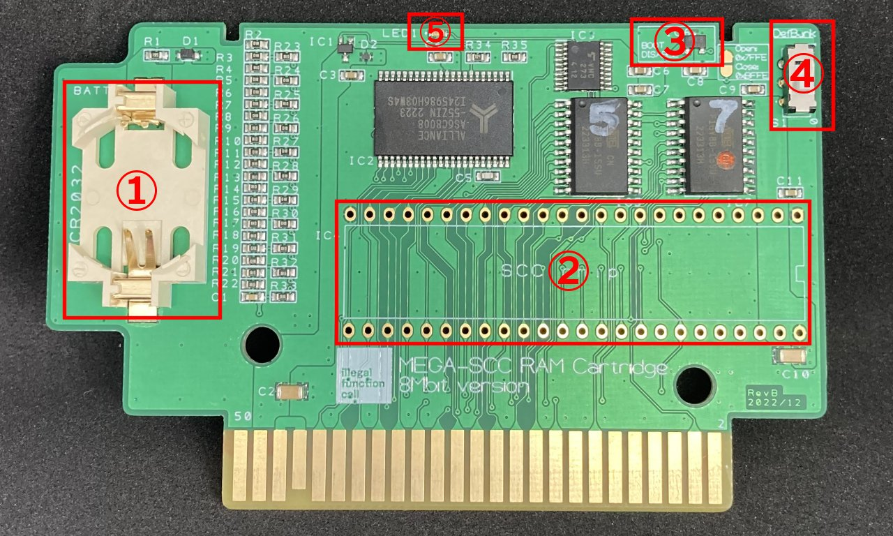  

## ■ 基板の組み立て
本製品は、表面実装部品はすべて実装済みの半完成品での頒布になります。  

IC4に、SCC (2212P003) を半田付け、電池を取り付ければ完成です。取り付け方向に注意してください。  

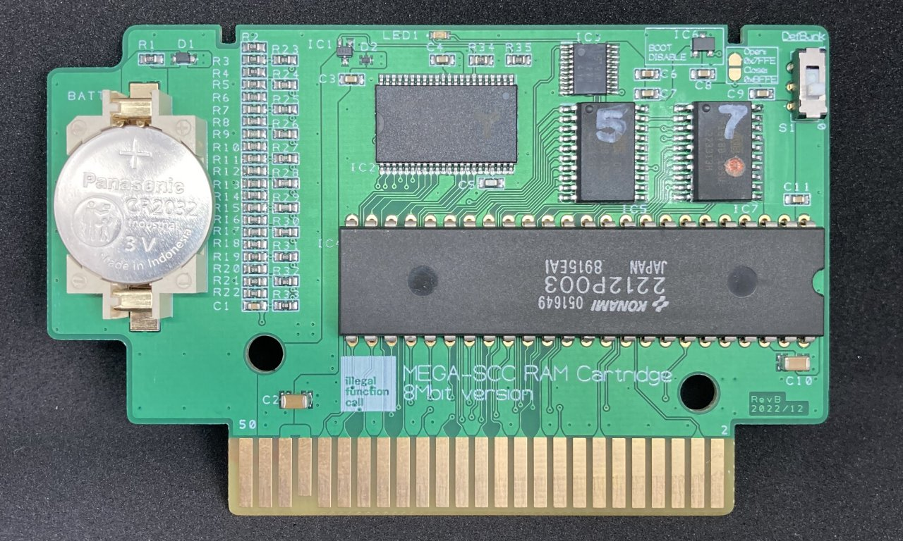  


## ■ 電池の取り付け・交換方法
電池の＋側を上にして取り付けください。  
挿入時は、電池ケース凹部に＋側の表示側を先にはめ込んでください。  
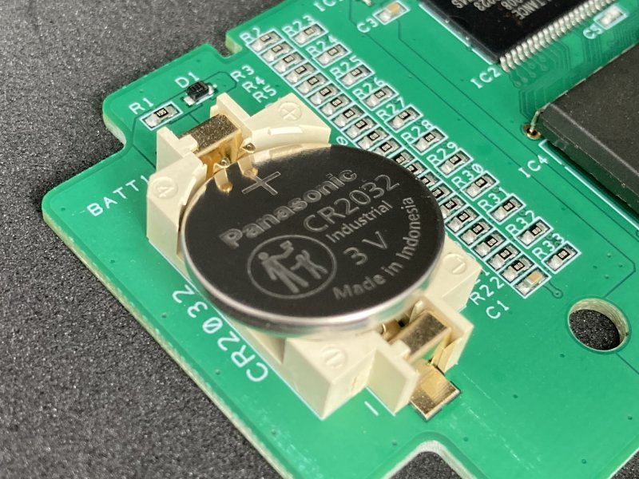 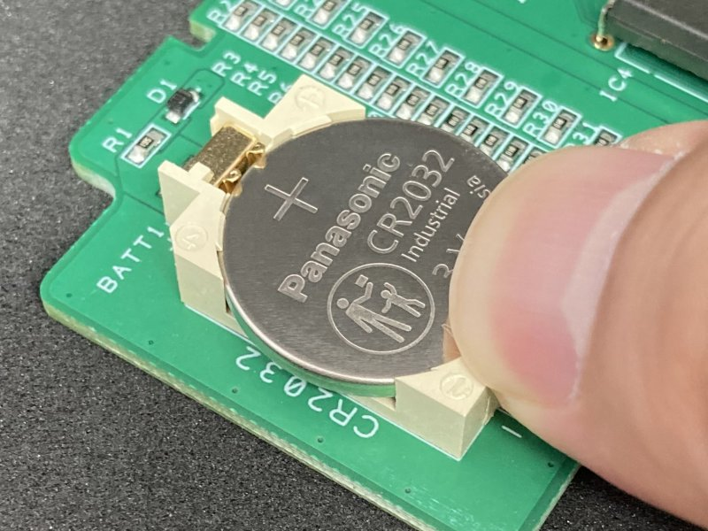  


（許容充電電流のスペックにより）  
交換品のCR2032については、パナソニック/マクセル/SONY/村田製を推奨します。  

## ■ マグネットセンサーの使い方
センサー近辺に磁石を近づけると、一時的にカセットを切り離すことができます。  
SRAM書き換え時など、ROMから起動させたくない場合に利用してください。  
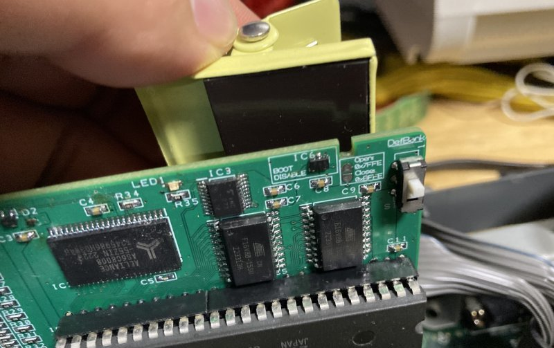  

## ■ バンク切り替えスイッチ
スイッチの切り替えで前半と後半4MbitをSWAPすることができます。  
動作中はどちらかに固定して使用してください。  

4MbitまでのROMデータを使用する場合はマルチカートとして使用することが可能です。  
使いたいBANKにスイッチを切り替えて使用してください。  

## ■ KONAMI カセットシェルを使う場合の注意
シェルの加工が必要です。赤丸の突起を折り取ってください。  
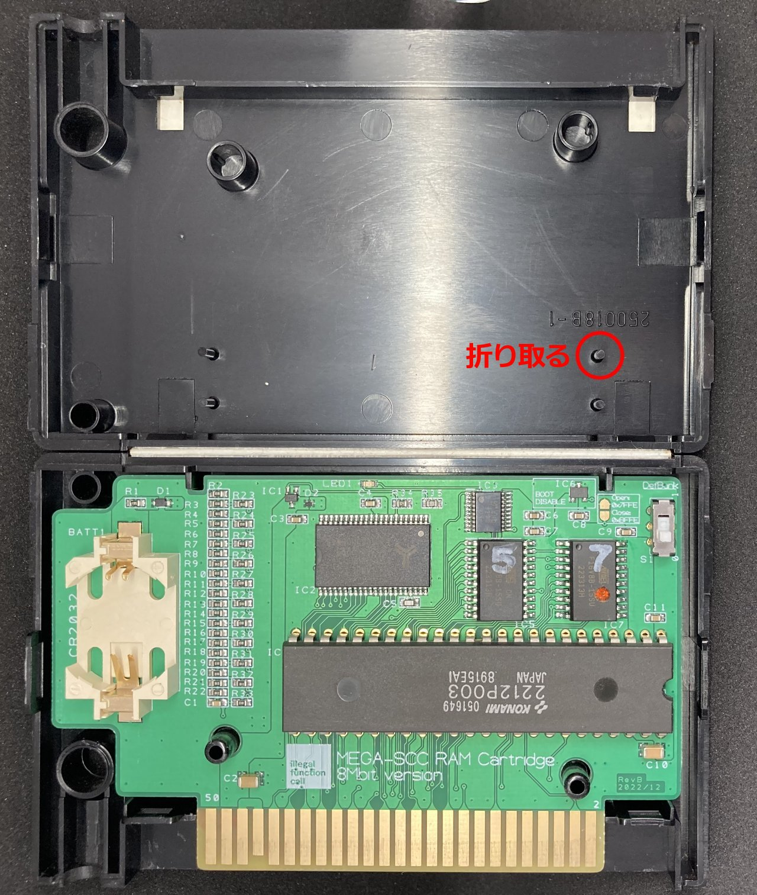  


## ■ 動作確認ソフト
動作確認用に、SRAM領域をWrite/Read/Verifyする。SCCRAM_TESTを用意しています。
```
>sccram.com
```
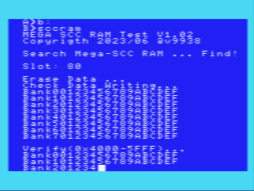 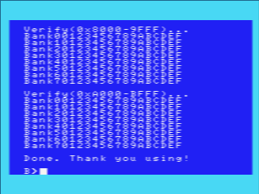  

ソースコードは、z88dkでコンパイル可能です。コンパイルオプションは下記になります。  
```
>zcc +msx -create-app -subtype=msxdos -lmsxbios  main.c -o xxxx.com`  
```


## ■ その他対応ソフトについて
niga氏作成のMGLOADにて、拡張領域を含み、認識および書き込み可能なことを確認しています。  

### ●MGINST.COMについて
SCC RAM DISKの作成ができる辻川氏のMGINST.COMについては、似非SCC RAMと非互換部分の問題でフリーズします。  
同梱しているPatchを実行して修正してください。(似非SCC RAMより8K Byte使える容量が減ります)  


[MGINST.COM Ver2.15用Patchソフト](./MGINST_PATCH/mgpatch.com) [zip形式](./MGINST_PATCH/mgpatch.zip)  

実行手順：
1．MGINST.COMを実行して、RAMDISKを作成します。
```
>mginst DISKBIOS.ROM /Sxx /D
```
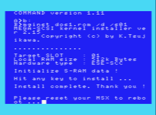  

2. 指示に従い再起動しDOSを起動させます。起動できない場合は切り離しスイッチを使ってDISKからDOSを起動させてください。  

3. MGPATCH.COMを実行し、Patchを当てます。実行後は再起動してください。
```
>mgpatch
```
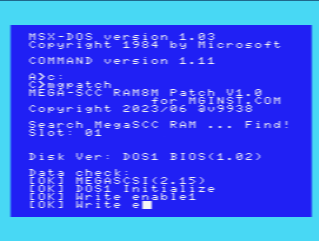 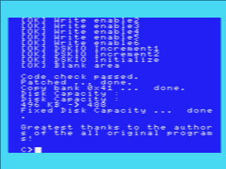  

## ■SRAMのバックアップについて
電圧監視ICにて、本機の供給電圧が4V以下(<140ms)になった時にバックアップモードに移行します。  
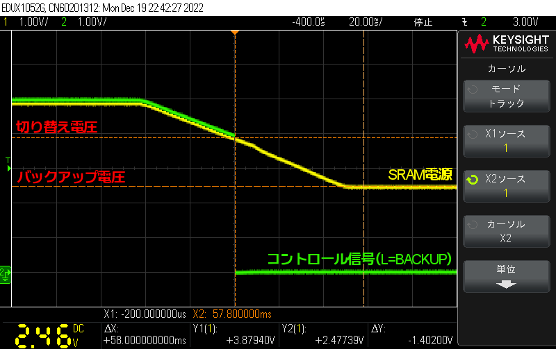 　　

バックアップ電流は、7～6uA程度で、CR2023の公称容量220mAでは3～4年程度データ保存が可能です。  


## ■本機の仕様について

### ●メモリマップ
オリジナルのSCC ROMに準拠しています。

| Page (8kB)                        | Switching address            | Initial segment |  
| --------------------------------- | ---------------------------- | --------------- |  
| BANK1:4000h ~ 5FFFh  | 5000h (mirrors: 5001h ~ 57FFh) | 0               |  
| BANK2:6000h ~ 7FFFh  | 7000h (mirrors: 7001h ~ 77FFh) | 1               |  
| BANK3:8000h ~ 9FFFh  | 9000h (mirrors: 9001h ~ 97FFh) | 2               |  
| BANK4:A000h ~ BFFFh  | B000h (mirrors: B001h ~ B7FFh) | 3               |  


Segmentは、00～3fhが使用できます。  
| BIT7 | BIT6 | BIT5 | BIT4 | BIT3 | BIT2 | BIT1 | BIT0 |  
| ---- | ---- | ---- | ---- | ---- | ---- | ---- | ---- |  
| Unused | Unused | Segment[5] | Segment[4] | Segment[3] | Segment[2] | Segment[1] | Segment[0] |  
  
Bit 0 ~ 5 = Segment number  
Bit 6 ~ 7 = Unused  

※BANK3 Segment 3fhは、SCCのWave Memoryに割り当てられている箇所があります。  

### ● コントロールレジスタ(7FFE-7FFFh)
書き込み専用のレジスタです。上位番地およびRAMへの書き込みをコントロールをするレジスタになります。  
アドレスは7FFE/7FFFhです。どちらのアドレスでも同じ扱いになります。  

| BIT7 | BIT6 | BIT5 | BIT4 | BIT3 | BIT2 | BIT1 | BIT0 |  
| ---- | ---- | ---- | ---- | ---- | ---- | ---- | ---- |  
| LED | UPPER/LOWER | Unused | SRAM WRITE | Unused | Unused | Unused | Unused |  
  
Bit 4 = SRAM書き込みモード切替   
　　　　　0=SRAM書き込み禁止,BANK切替有効 / 1=書き込み可,BANK切替無効  

Bit 6 = SRAM上位番地/下位番地選択   
　　　　　0=SRAM前半4Mbit指定/1=SRAM後半4Mbit指定  
  
Bit 7 = LED  
　　　　　0=LED消灯/1=LED点灯  

## ■ 似非SCC RAMとの仕様の違いについて
512KByte以上の領域の扱いについて、似非SCC RAMと下記の仕様違いがあると思われます。  
（実物持っていないので、ちゃんと調べていません＾＾；）  

当該スロットのPAGE1上からSRAM UPPER/LOWERのコントロールレジスタ書き換えた場合は、  
本機では自身のデータが切り替わることに注意してください。  


| カセットの種類 | コントロ-ルレジスタ SRAM UPPER/LOWERのSRAM番地の切り替え |  
| ---- | ---- |  
| 似非SCC RAM　| BANK3(8000～9FFFh)/BANK4(A000～BFFFh)のアドレス領域で有効 |  
| MEGA-SCCRAM | すべてのBANK1～BANK4(8000～BFFFh)で有効 |  


## ■ カートリッジ基板について

回路図、および基板のガーバデータを同梱しています。  
  
### ●基板
  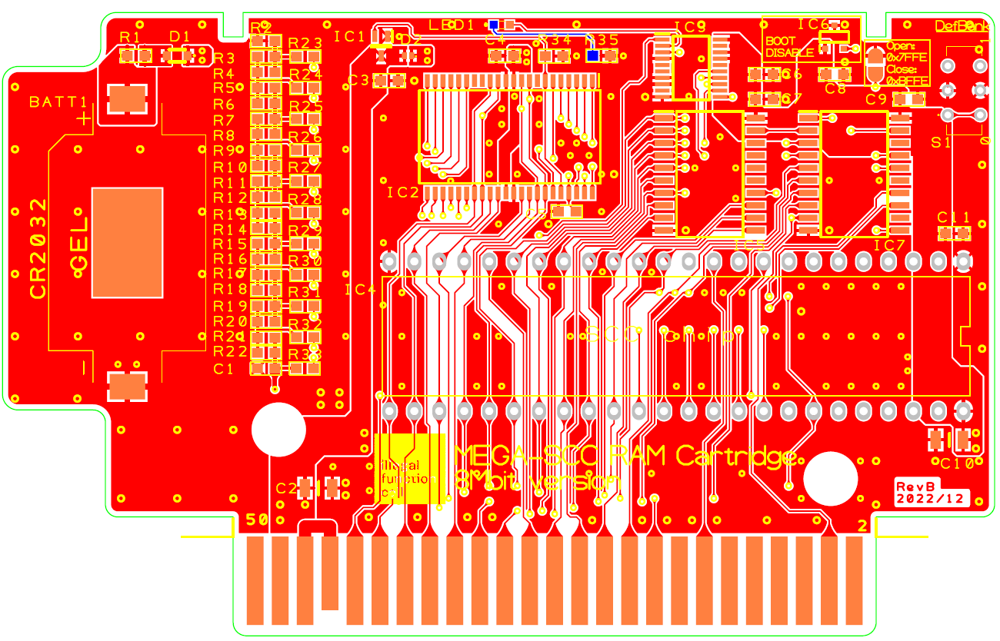　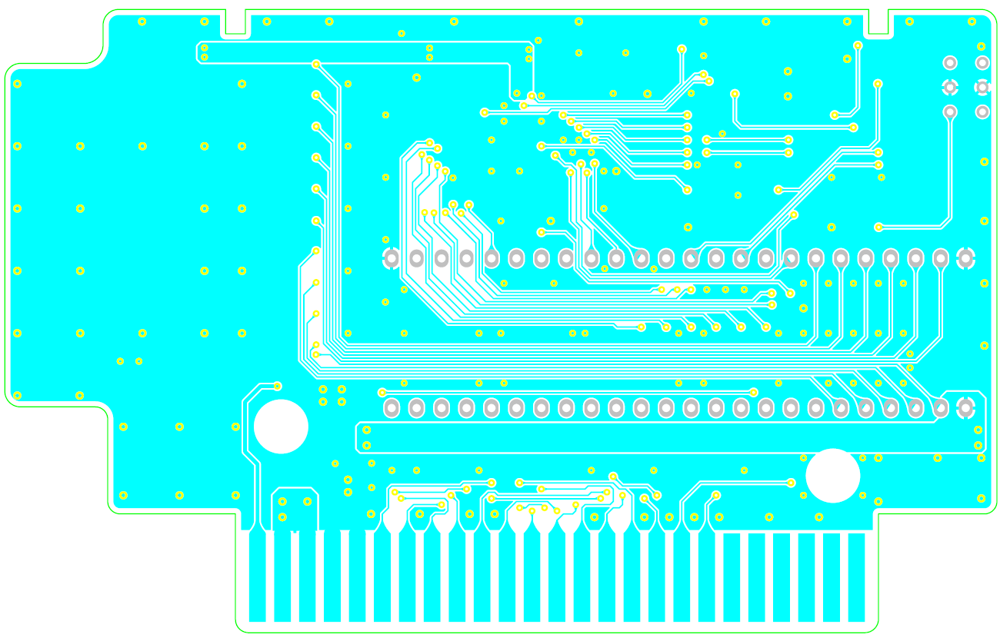  

### ●回路図

全体の回路図については下記を参照してください。
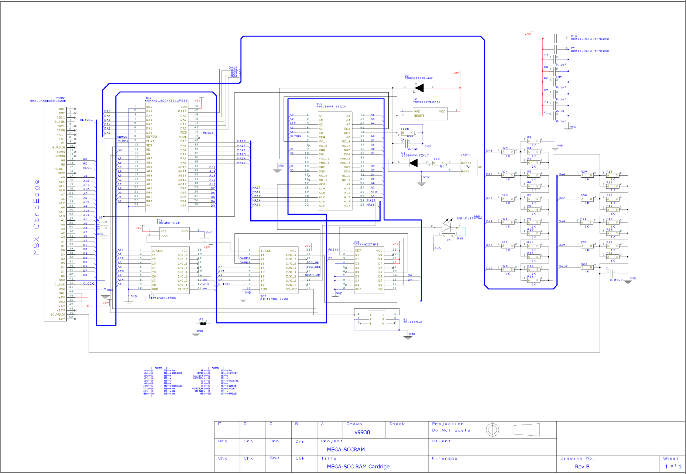  

### ●部品表
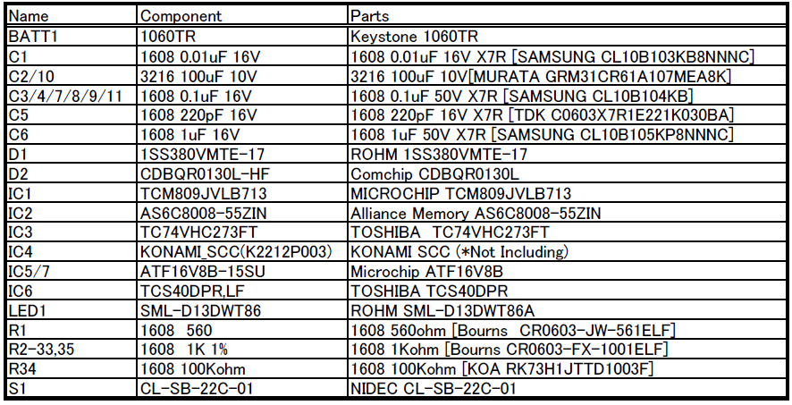  

### ●CPLD
Microchip ATF16V8を使用しています。  
JEDファイルは下記になります。

[IC5 ADDRMAN](./CPLD/IC5_ADDMAN/ADDRMAN.jed)  
[IC7 ADDRMAN2](./CPLD/IC7_ADDMAN2/ADDMAN2.jed)  
